# VulnFlow - AI-Powered Smart Contract Security Auditor

<div align="center">


**An AI-assisted platform for analyzing and fixing smart contract vulnerabilities on Flow EVM**

[🔗 Live Demo](https://vuln-flow.vercel.app/) | [📹 Video Demo](#) | [🐦 Twitter Post](#)

</div>

---

## 🌟 Why VulnFlow Matters

Smart contract vulnerabilities have led to **billions of dollars in losses** across the blockchain ecosystem. Traditional security audits are:
- ⏱️ **Time-consuming** (weeks to months)
- 💰 **Expensive** ($5,000 - $50,000+ per audit)
- 🔒 **Inaccessible** to indie developers and small teams
- 🐌 **Slow to adapt** to new vulnerability patterns

**VulnFlow democratizes smart contract security** by providing:
- ✅ **Instant AI-powered analysis** of Solidity and Cadence contracts
- 🤖 **Automated vulnerability detection** using advanced pattern matching
- 🔧 **One-click auto-fix** for common security issues
- 💎 **Token-based economy** with daily free claims for developers
- 🚀 **Built on Flow EVM** for fast, low-cost transactions

---

## 🏗️ Built on Flow EVM Testnet

**Network:** Flow EVM Testnet  
**Chain ID:** 545  
**RPC URL:** https://testnet.evm.nodes.onflow.org

### 📜 Deployed Smart Contracts

| Contract | Address | Explorer |
|----------|---------|----------|
| **VulnFlowToken (VFT)** | `0x14d1C30fd8647979DCDe3F5EAa296C195B84c0EF` | [View on Explorer](https://evm-testnet.flowscan.io/address/0x14d1C30fd8647979DCDe3F5EAa296C195B84c0EF) |

---

## 🎯 Key Features

### 🔍 AI-Powered Analysis
- Deep vulnerability scanning for Solidity and Cadence smart contracts
- Detection of common vulnerabilities: reentrancy, integer overflow, access control issues, and more
- Severity-based risk assessment (Critical, High, Medium, Low)
- Detailed explanations and remediation recommendations

### 🪄 Auto-Fix AI
- One-click automated fixes for detected vulnerabilities
- Generates secure, gas-optimized code
- Preserves contract logic while eliminating security risks

### 💰 VFT Token Economy
- **VulnFlowToken (VFT)**: ERC-20 utility token for platform services
- **Daily Claim**: Get 10 VFT tokens every 24 hours (free!)
- **Persistent Wallet**: Auto-reconnect with RainbowKit integration

### 📊 Real-Time Metrics
- Vulnerability distribution charts
- Severity-based statistics
- Code quality metrics
- Security score calculation

---

## 🔄 Workflow Architecture

```mermaid
graph TD
    A[Developer Connects Wallet] -->|RainbowKit| B[Flow EVM Testnet]
    B --> C{Has VFT Tokens?}
    C -->|No| D[Claim Daily VFT]
    C -->|Yes| E[Upload Smart Contract]
    D -->|10 VFT Minted| E
    
    E --> F[AI Analysis Engine]
    F --> G{Vulnerabilities Found?}
    
    G -->|Yes| H[Display Analysis Report]
    G -->|No| I[Contract is Secure ✓]
    
    H --> J{User Wants Auto-Fix?}
    J -->|Yes| K[AI Generates Fixed Code]
    K --> L[Display Fixed Contract]
    
    J -->|No| M[Manual Review]
    
    style A fill:#e1bee7
    style D fill:#c5e1a5
    style F fill:#90caf9
    style K fill:#a5d6a7
    style I fill:#81c784
```



## 🏗️ System Architecture


## 🔐 Security Analysis Flow


---

## 🚀 Getting Started

### Prerequisites
- Node.js 18+ or Bun
- MetaMask or compatible Web3 wallet
- Flow EVM Testnet configuration

### Installation

```bash
# Clone the repository
git clone https://github.com/manjeetsharma0796/VulnFlow.git
cd VulnFlow

# Install dependencies
bun install
# or
npm install

# Set up environment variables
cp .env.example .env.local
# Add your WalletConnect Project ID
```

### Environment Variables

Create a `.env.local` file:

```env
NEXT_PUBLIC_WALLETCONNECT_PROJECT_ID=your_project_id_here
```

### Running Locally

```bash
# Development server
bun run dev
# or
npm run dev

# Open http://localhost:3000
```

### Configure Flow EVM Testnet in MetaMask

1. **Network Name:** Flow EVM Testnet
2. **RPC URL:** https://testnet.evm.nodes.onflow.org
3. **Chain ID:** 545
4. **Currency Symbol:** FLOW
5. **Block Explorer:** https://evm-testnet.flowscan.io

---

## 🎮 How to Use

### 1️⃣ Connect Your Wallet
- Click "Connect Wallet" in the navbar
- Select your preferred wallet (MetaMask, WalletConnect, etc.)
- Approve the connection to Flow EVM Testnet

### 2️⃣ Claim Free VFT Tokens
- Click "Claim Daily 🎁" button
- Receive 10 VFT tokens instantly
- Wait 24 hours for next claim

### 3️⃣ Analyze Smart Contracts
- Navigate to the App page
- Paste your Solidity or Cadence contract code
- Click "Analyze Contract"
- Review the detailed vulnerability report

### 4️⃣ Auto-Fix Vulnerabilities
- After analysis, click "Auto-Fix AI 🪄"
- Receive secure, fixed contract code instantly
- Download or copy the improved code

---

## 🛠️ Technology Stack

### Frontend
- **Next.js 14** - React framework with App Router
- **TypeScript** - Type-safe development
- **Tailwind CSS** - Utility-first styling
- **Framer Motion** - Smooth animations
- **Monaco Editor** - VS Code-powered code editor
- **Shadcn UI** - Beautiful component library

### Blockchain
- **Wagmi v2** - React hooks for Ethereum
- **RainbowKit** - Wallet connection UI
- **Viem** - TypeScript Ethereum library
- **Flow EVM** - Fast, low-cost smart contract platform

### Smart Contracts (Solidity)
- **VulnFlowToken** - ERC-20 utility token with daily claim functionality

---

## 📁 Project Structure

```
vulnflow/
├── app/                      # Next.js App Router
│   ├── api/                  # API routes
│   │   ├── analyze/          # Contract analysis endpoint
│   │   └── autofix/          # Auto-fix endpoint
│   ├── app/                  # Main app page
│   ├── claim/                # Claim tokens page
│   └── wallet/               # Wallet management
├── components/               # React components
│   ├── ui/                   # UI primitives
│   ├── landing/              # Landing page sections
│   ├── Navbar.tsx            # Navigation bar
│   ├── CodeEditor.tsx        # Monaco editor wrapper
│   ├── AnalysisResult.tsx    # Vulnerability display
│   └── AutoFixButton.tsx     # Auto-fix trigger
├── contracts/                # Solidity smart contracts
│   └── VulnFlowToken.sol     # ERC-20 token with claim
├── abis/                     # Contract ABIs
├── lib/                      # Utility libraries
│   ├── contract.ts           # Contract interactions
│   ├── wallet.ts             # Wallet configuration
│   └── providers.tsx         # Web3 providers
└── config/                   # Configuration files
    └── contracts.json        # Contract addresses
```

---

## 🔒 Smart Contract Details

### VulnFlowToken (VFT)

```solidity
// ERC-20 Token for platform utility
// Features:
// - Mintable by owner
// - Burnable
// - 18 decimals
// - Daily claim functionality (24-hour cooldown)
// - Used for platform services
```

**Key Functions:**
- `mint(address to, uint256 amount)` - Mint new tokens (owner only)
- `transfer(address to, uint256 amount)` - Transfer tokens
- `approve(address spender, uint256 amount)` - Approve spending
- Daily claim integrated in frontend (10 VFT per 24 hours)

---

## 🎥 Video Demo

> **[📹 Watch the Full Demo](your-video-link-here)**

The video demonstrates:
- Wallet connection on Flow EVM Testnet
- Daily VFT token claiming
- Smart contract vulnerability analysis
- Auto-fix feature in action

---

## 🐦 Social Media

**Follow the project and Flow:**

> **[🐦 Twitter/X Announcement Post](your-twitter-post-link)**
> 
> Introducing VulnFlow - AI-powered smart contract security on @flow_blockchain! 🔐✨
> 
> Free vulnerability scanning + auto-fix for Solidity & Cadence contracts. Built on #FlowEVM Testnet!

---

## 🌐 Why Flow EVM?

VulnFlow is built on **Flow EVM Testnet** because:

1. **⚡ Performance** - Fast block times and low latency
2. **💰 Cost-Effective** - Minimal gas fees for developers
3. **🔄 EVM Compatibility** - Use existing Solidity contracts and tools
4. **🌍 Scalability** - Flow's architecture handles high throughput
5. **👥 Developer-Friendly** - Great documentation and tooling
6. **🎯 Web3 Focus** - Designed for the next generation of dApps

Flow EVM combines the **best of Ethereum's ecosystem** with **Flow's performance**, making it perfect for a security platform that needs to be both powerful and accessible.

---

## 🗺️ Roadmap

### ✅ Phase 1 - MVP (Current)
- [x] Smart contract deployment on Flow EVM Testnet
- [x] Basic vulnerability detection
- [x] VFT token economy
- [x] Daily claim system
- [x] Auto-fix feature

### 🚧 Phase 2 - Enhancement (Q1 2025)
- [ ] Advanced AI models for deeper analysis
- [ ] Support for more vulnerability types
- [ ] Batch contract analysis
- [ ] Historical audit reports
- [ ] User dashboards

### 🔮 Phase 3 - Expansion (Q2 2025)
- [ ] Mainnet deployment
- [ ] Cadence contract analysis
- [ ] Integration with GitHub
- [ ] API access for developers
- [ ] Community-driven vulnerability database

### 🌟 Phase 4 - Ecosystem (Q3 2025)
- [ ] Bug bounty program
- [ ] Security researcher rewards
- [ ] DAO governance
- [ ] Cross-chain analysis
- [ ] Enterprise solutions

---

## 🤝 Contributing

We welcome contributions from the community! Here's how you can help:

1. **Fork the repository**
2. **Create a feature branch** (`git checkout -b feature/amazing-feature`)
3. **Commit your changes** (`git commit -m 'Add amazing feature'`)
4. **Push to the branch** (`git push origin feature/amazing-feature`)
5. **Open a Pull Request**

### Development Guidelines
- Write clean, documented code
- Follow TypeScript best practices
- Test smart contracts thoroughly
- Update README for new features

---

## 📄 License

This project is **open source** and available under the MIT License.

```
MIT License - Free to use, modify, and distribute
```

---

## 🔗 Links

- **Live App:** [vuln-flow.vercel.app](https://vuln-flow.vercel.app/)
- **GitHub:** [github.com/manjeetsharma0796/VulnFlow](https://github.com/manjeetsharma0796/VulnFlow)
- **Flow EVM Testnet:** [evm-testnet.flowscan.io](https://evm-testnet.flowscan.io)
- **Flow Docs:** [developers.flow.com](https://developers.flow.com)
- **Twitter:** [@your_handle](#)

---

## 📞 Contact & Support

- **Issues:** [GitHub Issues](https://github.com/manjeetsharma0796/VulnFlow/issues)
- **Discussions:** [GitHub Discussions](https://github.com/manjeetsharma0796/VulnFlow/discussions)
- **Twitter:** [@your_handle](#)
- **Email:** your.email@example.com

---

## 🙏 Acknowledgments

- **Flow Team** - For the amazing EVM-compatible blockchain
- **OpenZeppelin** - For secure smart contract standards
- **RainbowKit** - For seamless wallet integration
- **The Web3 Community** - For continuous support and feedback

---

<div align="center">

**Built with ❤️ on Flow EVM Testnet**

⭐ Star this repo if you find it helpful!

[⬆ Back to Top](#vulnflow---ai-powered-smart-contract-security-auditor)

</div>
